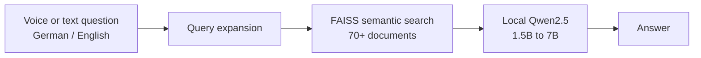
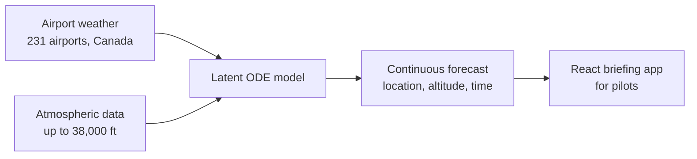

<!-- Profile README for github.com/riyazbiju/riyazbiju
     TODO before publishing: replace every "REPO_LINK" with the real repo URL,
     and confirm the LinkedIn and website links in the badges below. -->

---

## 👋 Hi, I'm Riya

I'm an AI Engineer. I build agents and LLM workflows that solve real problems for real teams, then keep improving them after launch.

- 🏭 **At BMW Group (Munich):** built a multi-agent system on a Neo4j knowledge graph for quality investigations. Now working on my Master Thesis there, on knowledge graphs and link prediction.
- 🤖 **At THWS (Würzburg):** built CAIRA, a local RAG assistant that answers in German and English, by voice or text.
- ✈️ **Master's project:** led a team of three to build SKYBRIEF, a weather briefing tool for pilots.

---

## 📊 By the numbers

| | |
|:--|:--|
| **1.5B → 1.6M** | Records narrowed down for real-time use in the BMW pipeline |
| **~1 day → minutes** | Time to assign a root cause after the multi-agent system went live |
| **−60%** | End-to-end response time on CAIRA after tuning retrieval and chunking |
| **>50%** | Lower prediction error for SKYBRIEF compared to two standard forecasting methods |
| **3× smaller** | Edge AI model after pruning, with accuracy up from 94.6% to 96.7% |

---

## 🚀 Featured projects

### 🎙️ CAIRA: a local voice and text assistant for university students

Runs fully on local NVIDIA servers, answers in German and English, and works over 70+ documents. Built with FastAPI, Gradio, FAISS, multilingual-e5-small embeddings, and Qwen2.5 (1.5B to 7B).

- Reached sub-second retrieval and cut response time by 60%.
- Handled vague, multi-part questions with automatic query expansion.
- Kept session state across a whole conversation.

🔗 [Repo](REPO_LINK)

### ✈️ SKYBRIEF: weather briefings for pilots

A Latent ODE model that predicts temperature, wind, and visibility continuously across location, altitude, and time. Trained on data from 231 airports across Canada plus atmospheric data up to 38,000 ft. I led the team and built the full stack, from the Python model to the React app pilots use.

- Cut prediction error by more than half against two standard methods.
- Beat the older methods by 60–67% on a real flight route.

🔗 [Repo](REPO_LINK)

### 🧩 More projects

| Project | What I built | Stack |
|:--|:--|:--|
| **[Edge AI PPE Detection](REPO_LINK)** | Pruned a MobileNet by ~69% (8.63 MB → 2.77 MB). Accuracy went up, and speed on a Raspberry Pi stayed the same. | `PyTorch` `MobileNet` `Raspberry Pi` |
| **[Explainable Pneumonia Detection](REPO_LINK)** | ResNet-18 on chest X-rays, with Grad-CAM and LIME to show where the model looks. | `PyTorch` `Grad-CAM` `LIME` |
| **[SignEase](REPO_LINK)** | Real-time sign language translation for inclusive meetings. Published in IJRAR (2024). | `CNN-LSTM` `MediaPipe` |
| **[β-VAE on CelebA](REPO_LINK)** | Face generation model that separates traits like head pose into adjustable controls. | `PyTorch` `VAE` |
| **[Prakrithi-Identifier](REPO_LINK)** | Ayurvedic constitution prediction, extended to skin disease detection with a camera. | `scikit-learn` `Computer Vision` |

---

## 🛠️ Tech stack

| Area | Tools |
|:--|:--|
| **Agents and LLMs** | LangChain, LangGraph, GraphRAG, Qwen, Llama, tool and skill interfaces |
| **Retrieval** | FAISS, vector databases, semantic search, multi-hop reasoning |
| **Graphs** | Neo4j, Cypher, graph projections, TransE, ComplEx, R-GCN |
| **Backend and data** | FastAPI, REST APIs, SQL, Oracle, Palantir Foundry, Docker, CI/CD |
| **Dashboards** | Power BI |

---

## 🏆 Recognition

- 🥇 Finalist, **Medha V** Global AI Data Viz Hackathon (BMW Techworks India)
- 📄 **IJRAR 2024**, two papers: Ayurveda + AI survey (IIT Palakkad innovation finalist) and SignEase
- 🥈 **2nd Best Paper**, National Conference on Emerging Frontiers of Medicine and Technology
- 🎓 **Best Outgoing Student Award**, Holy Grace Academy of Engineering (2024)

---

## 📈 GitHub stats

---

## 💬 Let's talk

- **Ask me about:** multi-agent systems, GraphRAG, running LLMs locally, and getting AI into real workflows
- **Happy to collaborate on:** agent tooling, knowledge graphs, and AI for healthcare and accessibility
- **Languages:** English (C1) · German (B1) · Malayalam · Tamil · Hindi

📫 **[Connect on LinkedIn](https://www.linkedin.com/in/riyabiju)** or email **bijuriya18@gmail.com**

> 🤖🤝👤 Still deciding whether to trust AI or humans, so I build AI that shows its work.

